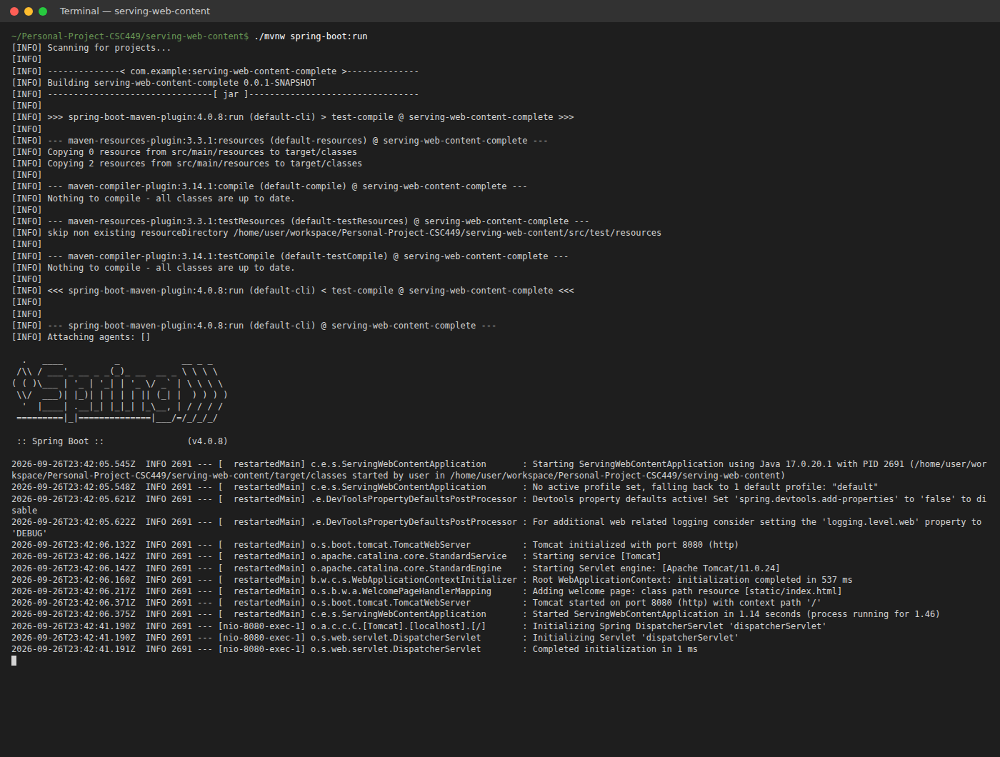
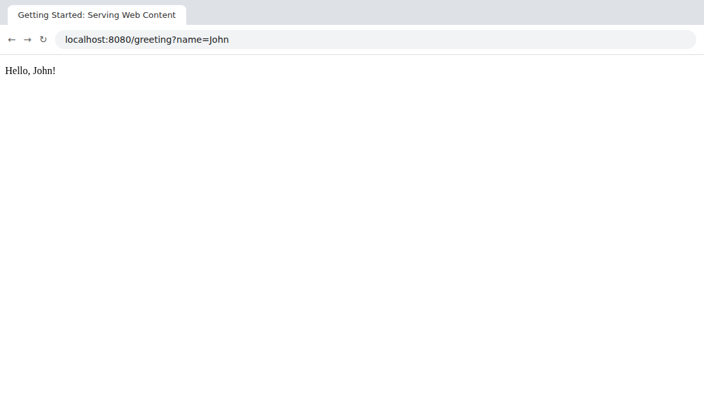

# Personal Project - CSC449

This repository is my CSC449 personal project. It contains course assignments, documentation, and source code.

## Project board

Work is tracked on the [Personal Project - CSC449 board](https://github.com/users/JohnYoungquist/projects/1), organized as Todo, In Progress, and Done. The repository and board are public and read-only for visitors.

## Assignment: Spring Boot MVC

The [`serving-web-content`](serving-web-content) folder contains a Spring Boot web application built from the Spring guide [Serving Web Content with Spring MVC](https://spring.io/guides/gs/serving-web-content/). It uses Spring Boot 4.0.8, Spring Web, Thymeleaf, and Spring Boot DevTools.

### Running the application

Requirements: JDK 17 or later. Maven is not needed because the project includes the Maven Wrapper.

```bash
cd serving-web-content
./mvnw spring-boot:run        # Windows: mvnw.cmd spring-boot:run
```

Then open [http://localhost:8080/greeting?name=John](http://localhost:8080/greeting?name=John). The page shows `Hello, John!`. Without the `name` parameter, it shows `Hello, World!`.

To build and run the executable JAR:

```bash
./mvnw clean package
java -jar target/serving-web-content-complete-0.0.1-SNAPSHOT.jar
```

### Screenshots

Command-line output from `./mvnw spring-boot:run`:



Browser result at `http://localhost:8080/greeting?name=John`:



### Evaluating the MVC implementation

This application uses the Model-View-Controller (MVC) pattern:

| MVC role | Implementation | Responsibility |
|---|---|---|
| Model | `org.springframework.ui.Model` | Holds the `name` attribute passed from the controller to the view. |
| View | `src/main/resources/templates/greeting.html` | Thymeleaf template that renders `Hello, ${name}!` as HTML on the server. |
| Controller | `GreetingController.java` | `@Controller` class. `@GetMapping("/greeting")` handles the request, reads the optional `name` query parameter with a default of `World`, adds it to the model, and returns the view name `greeting`. |

Request flow: the browser sends `GET /greeting?name=John`. Spring's `DispatcherServlet` routes the request to `GreetingController.greeting()`. The controller stores `name` in the model and returns `"greeting"`. Thymeleaf resolves `templates/greeting.html`, fills in the model value, and returns the finished HTML. The console log shows `DispatcherServlet` initializing when the first request arrives.

Strengths:

- Separation of concerns: the controller contains no HTML, and the template contains no request-handling logic. Each can change independently.
- Minimal configuration: `@SpringBootApplication` enables auto-configuration, component scanning, and an embedded Tomcat server. The application runs as a standalone JAR without a separate application server, which suits deployment as a microservice.
- Testability: the controller is a plain Java class, and the included test uses `MockMvc` to verify responses without starting a browser.
- Productivity: DevTools restarts the application automatically when classes change.

Limitations:

- The model is a simple key-value map, not a domain model. A larger application needs dedicated model classes and a service layer for business logic.
- Server-side rendering returns complete HTML pages. For a microservice consumed by other services, a `@RestController` that returns JSON, as shown in [Building an Application with Spring Boot](https://spring.io/guides/gs/spring-boot/), is often a better fit.
- Auto-configuration speeds up setup but can hide configuration details from developers.

## Getting started

```bash
git clone https://github.com/JohnYoungquist/Personal-Project-CSC449.git
cd Personal-Project-CSC449
```

## Learning resources

- [Spring: Building an Application with Spring Boot](https://spring.io/guides/gs/spring-boot/)
- [Spring: Serving Web Content with Spring MVC](https://spring.io/guides/gs/serving-web-content/)
- [Spring: Microservices with Spring Boot](https://spring.io/microservices)
- [GitHub: Creating a new repository](https://docs.github.com/en/repositories/creating-and-managing-repositories/creating-a-new-repository)
- [GitHub: About project boards (classic documentation)](https://docs.github.com/en/issues/organizing-your-work-with-project-boards/managing-project-boards/about-project-boards)
- [GitHub: Linking a repository to a project board (classic documentation)](https://docs.github.com/en/issues/organizing-your-work-with-project-boards/managing-project-boards/linking-a-repository-to-a-project-board)
- [Raju Gandhi, Head First Git: A Learner's Guide to Understanding Git from the Inside Out (2022), O'Reilly Media](https://nu.primo.exlibrisgroup.com/permalink/01NATIONAL_INST/cl5c2u/alma9925543807201661)
